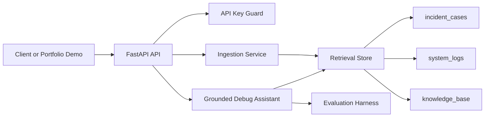

# Architecture

## Retrieval Collections

- `incident_cases`: synthetic incidents and public postmortem summaries.
- `system_logs`: Loghub-style public logs and local demo app logs.
- `knowledge_base`: public docs, runbooks, and project notes.

## Current Implementation

The first implementation uses deterministic local embeddings and in-memory retrieval so the API and tests work immediately. The service boundary is intentionally small, making PostgreSQL + pgvector a later replacement rather than a rewrite.

