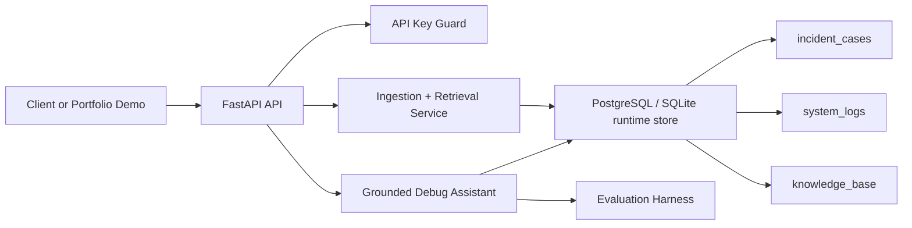
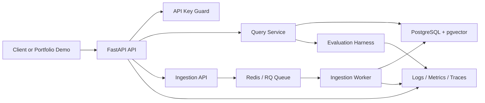
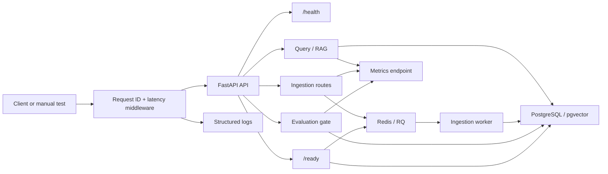

# Architecture

## Current State

The current implementation boots a runtime database-backed retriever on application startup. For PostgreSQL, startup applies Alembic migrations before seeding and serving requests. SQLite fallback is now explicit and opt-in through `ALLOW_SQLITE_FALLBACK=true`; production-like startup no longer downgrades silently when Postgres is unavailable. In both cases, it persists knowledge records, deterministic embeddings, retrieval traces, and evaluation runs. Document and log ingestion now enqueue Redis/RQ jobs, debug-case creation persists a durable record immediately, and the background worker re-indexes the same debug-case content without changing the API response shape.

## Target State

The target platform persists records and embeddings, uses pgvector retrieval, moves ingestion through workers, exposes observable runtime signals, and can later be deployed through CI/CD and AWS infrastructure. Queue failures are now treated as explicit service availability problems at the API boundary instead of implicit server errors.

## Phase 5 Observability Overview

Phase 5 adds local application observability before cloud observability. The implementation order is structured logging, request IDs, readiness, and metrics. Grafana dashboards, cloud log aggregation, alerting, and Kubernetes monitoring stay out of scope until later DevOps phases.

If the project later needs multi-step stateful incident triage, LangGraph is the likely candidate for the orchestration layer. If the team later wants provider or tool abstraction, LangChain is the likely candidate. For now, both are intentionally out of scope so the platform stays auditable and easy to reason about.

## Retrieval Collections

- `incident_cases`: synthetic incidents and public postmortem summaries.
- `system_logs`: Loghub-style public logs and local demo app logs.
- `knowledge_base`: public docs, runbooks, and project notes.

## Current Implementation

The service boundary is intentionally small, but the live app now uses the database-backed retriever behind the same API response shape. The Docker, compose, and CI files are still scaffold until Phase 6 validates them as accepted platform assets.

