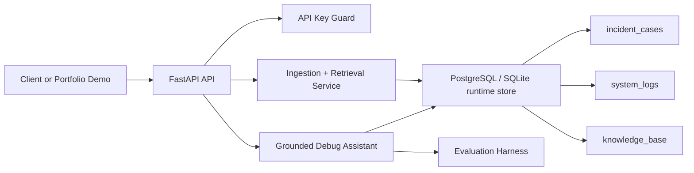
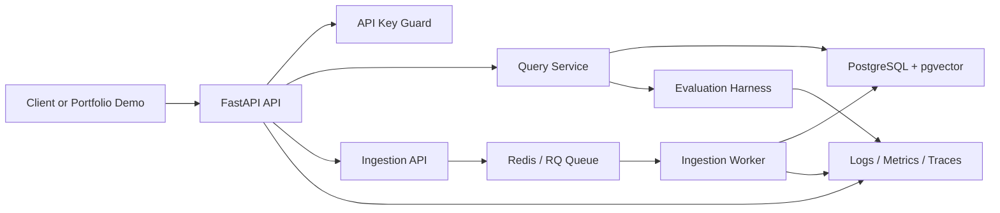

# Architecture

## Current State

The current implementation boots a runtime database-backed retriever on application startup. For PostgreSQL, startup applies Alembic migrations before seeding and serving requests. For SQLite, startup uses the `create_all()` fallback for lightweight local development and tests. In both cases, it persists knowledge records, deterministic embeddings, retrieval traces, and evaluation runs.

## Target State

The target platform persists records and embeddings, uses pgvector retrieval, moves ingestion through workers, exposes observable runtime signals, and can later be deployed through CI/CD and AWS infrastructure.

## Retrieval Collections

- `incident_cases`: synthetic incidents and public postmortem summaries.
- `system_logs`: Loghub-style public logs and local demo app logs.
- `knowledge_base`: public docs, runbooks, and project notes.

## Current Implementation

The service boundary is intentionally small, but the live app now uses the database-backed retriever behind the same API response shape. The Docker, compose, and CI files are still scaffold until Phase 6 validates them as accepted platform assets.

