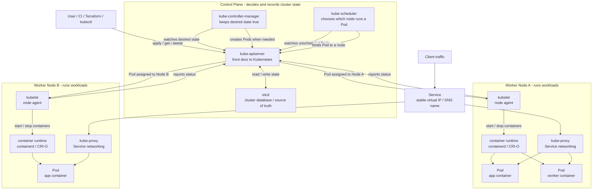
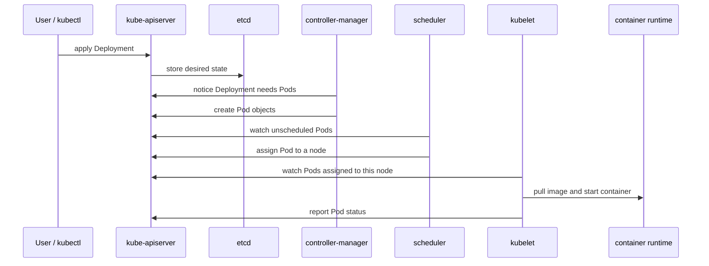

# Kubernetes Components Visual

This diagram shows the basic Kubernetes components and how a request becomes a running container.

## Cluster Diagram



## Request Flow



## Mental Model

```text
User/kubectl
    |
    v
kube-apiserver <----> etcd
    |
    +--> controllers create or repair resources
    |
    +--> scheduler picks a node for each new Pod
    |
    v
kubelet on selected node
    |
    v
container runtime
    |
    v
running Pod

kube-proxy runs on each node and helps Service traffic reach the right Pods.
```

## Component Legend

- `kube-apiserver`: the front door. All Kubernetes requests go through it.
- `etcd`: the database. Stores the cluster source of truth.
- `kube-scheduler`: the placement engine. Decides which node should run a Pod.
- `kube-controller-manager`: the reconciliation engine. Keeps actual state matching desired state.
- `kubelet`: the node agent. Starts Pods assigned to its node and reports status.
- `container runtime`: the actual container runner, usually `containerd` or `CRI-O`.
- `kube-proxy`: the Service networking helper. Routes Service traffic to backend Pods.
- `Pod`: the smallest deployable unit in Kubernetes. Usually wraps one main app container.
- `Service`: a stable network identity for a changing set of Pods.

## One-Sentence Version

You tell the `kube-apiserver` what you want, `etcd` remembers it, controllers create missing objects, the scheduler chooses a node, the kubelet starts the containers, and kube-proxy helps network traffic reach them.
