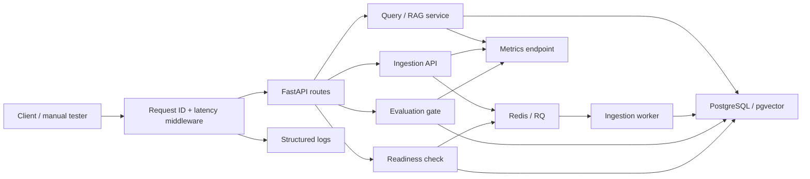

# Phase 5 Plan: Observability

## Approach

Add local observability before cloud observability. Keep the first implementation minimal but real: structured logs, request ids, metrics endpoint, and readiness checks.

## Implementation Sessions

1. Logging foundation: configure structured logging and stable event names.
2. Request IDs and API middleware: correlate every HTTP request with a request ID, latency, status, and response header.
3. Health and readiness: keep liveness simple and add dependency-aware readiness for runtime, database, and Redis.
4. Metrics and local proof: expose local metrics and document how to verify them before cloud work.

## Signals

- Request count and latency.
- Retrieval hit count and score summary.
- Evaluation pass/fail summary.
- Ingestion success and failure.
- Health and readiness state.

## Architecture Overview

## Validation

- Tests for health and readiness.
- Tests for request ID propagation.
- Tests for metrics surface where deterministic.
- Manual local proof of logs and metrics.
- Documentation updates for the operational demo.
